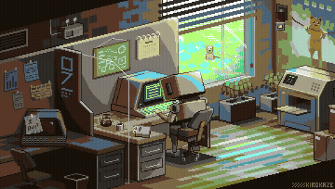
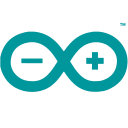
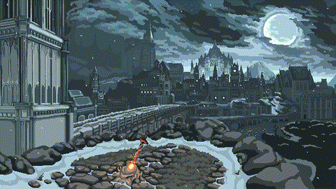

<div align="center">

```
   _____       __        __                              ____                  __     
  / ___/____ _/ /_  ____/ /___ __________ _____         / __ \____ _____  ____/ /___ _
  \__ \/ __ `/ __ \/ __  / __ `/ ___/ __ `/ __ \       / /_/ / __ `/ __ \/ __  / __ `/
 ___/ / /_/ / / / / /_/ / /_/ / /  / /_/ / / / /      / ____/ /_/ / / / / /_/ / /_/ / 
/____/\__,_/_/ /_/\__,_/\__,_/_/   \__,_/_/ /_/      /_/    \__,_/_/ /_/\__,_/\__,_/  
```


<br/>

<a href="https://linkedin.com/in/-nitinpandey-"></a>&nbsp;<a href="mailto:nitinpandey11223@gmail.com"></a>

</div>


**_Stack Used_**

<!-- STACK:AUTO:START -->
<table align="center">
    <tr>
        <td align="center" width="90"><br>Arduino</td>
        <td align="center" width="90"><br>CSS3</td>
        <td align="center" width="90"><br>Docker</td>
        <td align="center" width="90"><br>ESP32</td>
        <td align="center" width="90"><br>Flask</td>
        <td align="center" width="90"><br>Git</td>
        <td align="center" width="90"><br>GitHub</td>
    </tr>
    <tr>
        <td align="center" width="90"><br>HTML5</td>
        <td align="center" width="90"><br>JavaScript</td>
        <td align="center" width="90"><br>Kotlin</td>
        <td align="center" width="90"><br>Linux</td>
        <td align="center" width="90"><br>Next.js</td>
        <td align="center" width="90"><br>NumPy</td>
        <td align="center" width="90"><br>Pandas</td>
    </tr>
    <tr>
        <td align="center" width="90"><br>Python</td>
        <td align="center" width="90"><br>Raspberry Pi</td>
        <td align="center" width="90"><br>React</td>
        <td align="center" width="90"><br>STM32</td>
        <td align="center" width="90"><br>Swift</td>
        <td align="center" width="90"><br>Tailwind</td>
        <td align="center" width="90"><br>TypeScript</td>
    </tr>
    <tr>
        <td align="center" width="90"><br>VS Code</td>
    </tr>
</table>
<!-- STACK:AUTO:END -->


<p align="center">
  
</p>


<p align="center">
  <a href="https://holopin.io/@nltln">
    
  </a>
</p>




<p align="center">
  
</p>
